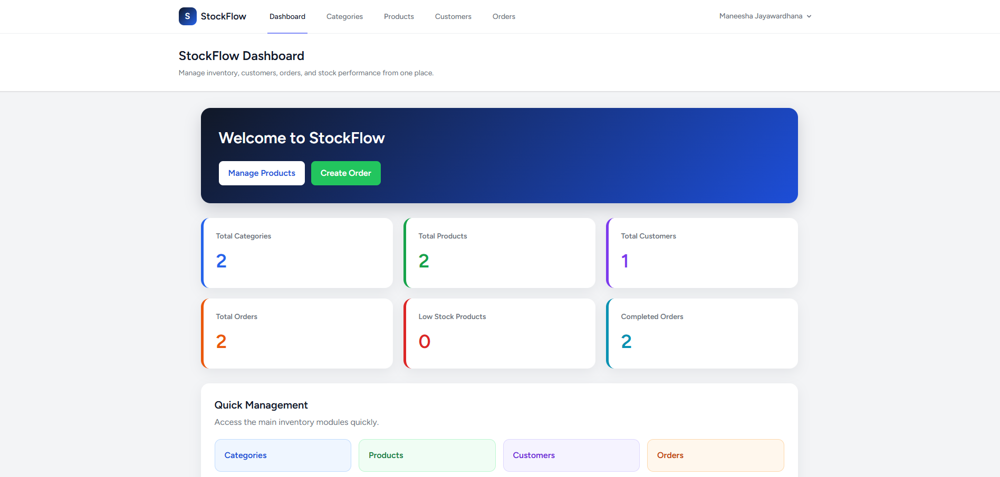
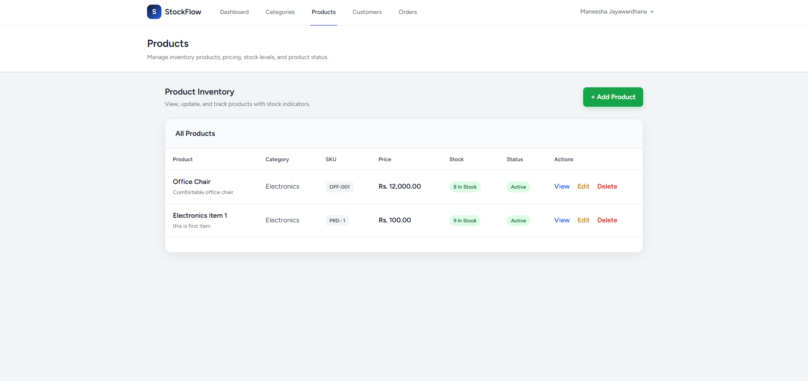
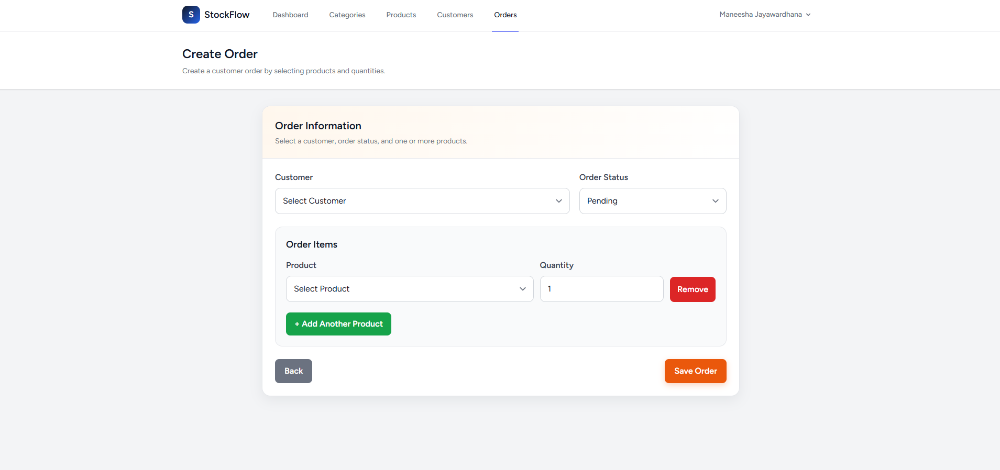
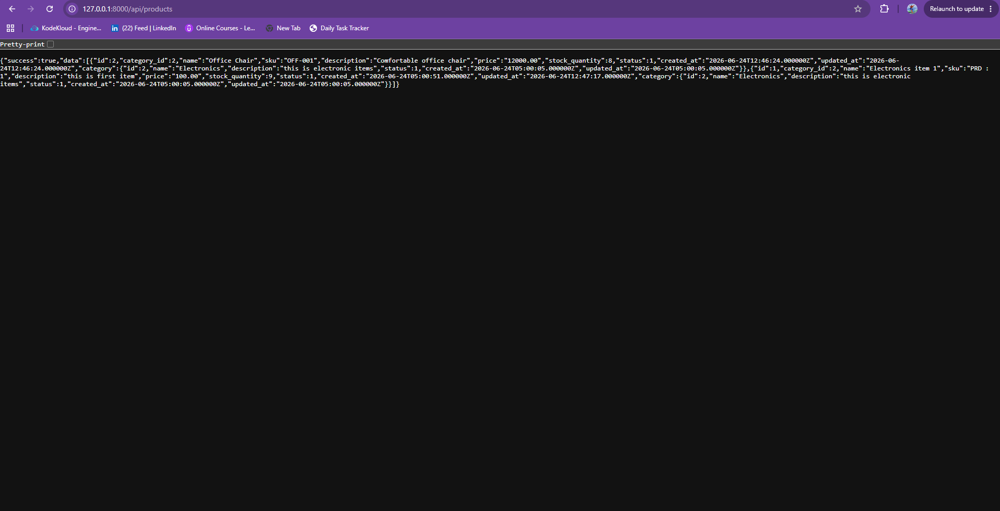
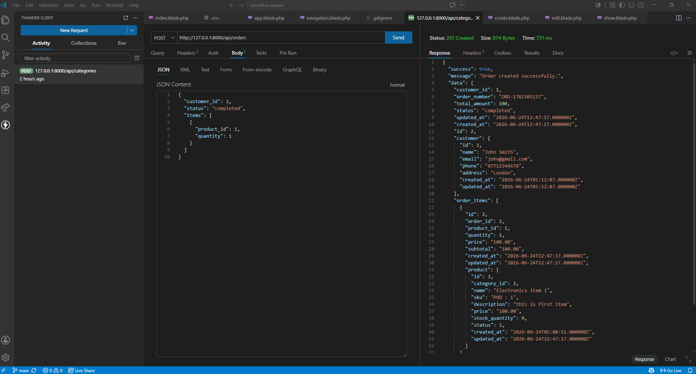

# StockFlow Inventory

StockFlow Inventory is a Laravel-based inventory and order management system designed for small business stock tracking and order handling. The system includes an admin dashboard, product management, customer management, order processing, stock quantity tracking, and REST API endpoints.

This project was built as a portfolio project to demonstrate practical Laravel development skills, including authentication, CRUD operations, database relationships, form validation, REST API development, and clean admin UI design.

---

## Features

* User authentication using Laravel Breeze
* Admin dashboard with business summary cards
* Category management
* Product management
* Customer management
* Order management
* Multiple products per order
* Order item quantity handling
* Automatic order total calculation
* Product stock quantity tracking
* Order status management: Pending, Completed, Cancelled
* REST API endpoints for main modules
* MySQL database relationships
* Professional responsive admin interface

---

## Tech Stack

* Laravel
* PHP
* MySQL
* Laravel Breeze
* Blade Templates
* Tailwind CSS
* Vite
* JavaScript
* REST API

---

## Screenshots

### Dashboard

The dashboard provides a quick overview of total categories, products, customers, orders, completed orders, and low-stock products.



---

### Products Management

The products page allows admins to manage product details such as category, SKU, description, price, stock quantity, and status.



---

### Create Order

The create order page allows admins to select a customer, choose multiple products, set quantities, and create customer orders.



---

### API Response

The project includes REST API endpoints for categories, products, customers, and orders.



---

### Orders API JSON Response

The orders API returns order details with related customer and order item data.



---

## Main Modules

### Dashboard

The dashboard provides a quick overview of the system, including total categories, products, customers, orders, completed orders, and low-stock products.

### Categories

The category module allows admins to create, view, edit, and delete product categories.

### Products

The product module manages product details such as category, SKU, description, price, stock quantity, and product status.

### Customers

The customer module stores customer details such as name, email, phone number, and address.

### Orders

The order module allows admins to create customer orders with multiple products and quantities. The system calculates order totals and stores order item details.

---

## API Endpoints

The project includes REST API endpoints for the main modules.

### Categories API

```http
GET /api/categories
POST /api/categories
GET /api/categories/{id}
PUT /api/categories/{id}
DELETE /api/categories/{id}
```

### Products API

```http
GET /api/products
POST /api/products
GET /api/products/{id}
PUT /api/products/{id}
DELETE /api/products/{id}
```

### Customers API

```http
GET /api/customers
POST /api/customers
GET /api/customers/{id}
PUT /api/customers/{id}
DELETE /api/customers/{id}
```

### Orders API

```http
GET /api/orders
POST /api/orders
GET /api/orders/{id}
PUT /api/orders/{id}
DELETE /api/orders/{id}
```

---

## Database Tables

The system uses the following main database tables:

* users
* categories
* products
* customers
* orders
* order_items
* personal_access_tokens

---

## Database Relationships

* A category has many products.
* A product belongs to a category.
* A customer has many orders.
* An order belongs to a customer.
* An order has many order items.
* An order item belongs to an order.
* An order item belongs to a product.

---

## Installation Guide

Clone the repository:

```bash
git clone https://github.com/Shehara-Jay/stockflow-laravel.git
```

Go to the project folder:

```bash
cd stockflow-laravel
```

Install PHP dependencies:

```bash
composer install
```

Install Node dependencies:

```bash
npm install
```

Create the environment file:

```bash
cp .env.example .env
```

Generate application key:

```bash
php artisan key:generate
```

Configure the database in `.env`:

```env
DB_CONNECTION=mysql
DB_HOST=127.0.0.1
DB_PORT=3306
DB_DATABASE=stockflow_db
DB_USERNAME=root
DB_PASSWORD=
```

Run migrations:

```bash
php artisan migrate
```

Start the Laravel development server:

```bash
php artisan serve
```

Start Vite:

```bash
npm run dev
```

Open the application in the browser:

```text
http://127.0.0.1:8000
```

---

## Test Login

Create a new account using the register page, then log in to access the dashboard.

---

## Project Highlights

This project demonstrates:

* Laravel MVC architecture
* Authentication with Laravel Breeze
* CRUD development
* MySQL database relationships
* One-to-many relationships
* Form validation
* REST API development
* Blade template design
* Admin dashboard UI
* Order and stock management logic
* Clean GitHub project structure

---

## Future Improvements

* Add product image upload
* Add sales reports
* Add invoice generation
* Add role-based access control
* Add search and filtering
* Add stock movement history
* Add order export as PDF
* Add deployment with cloud database

---

## Author

Maneesha Jayawardhana

GitHub: https://github.com/Shehara-Jay

LinkedIn: https://www.linkedin.com/in/maneesha-shehara-463a9b222/

Portfolio: https://maneesha-portfolio-snowy.vercel.app/
